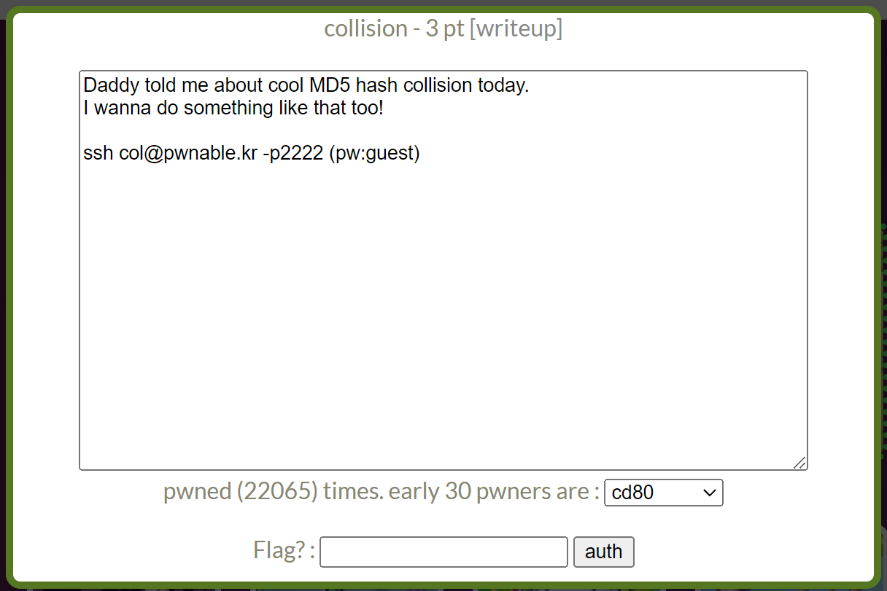

# pwnable.kr : collision
## INDEX
1. 문제 정보
    + 1.1 문제 이름
    + 1.2 문제 설명
    + 1.3 문제 분야
    + 1.4 문제 정답
2. 풀이 방법
    + 2.1 풀이 환경
    + 2.2 풀이 내용
    + 2.3 exploit code
---
## 1. 문제 정보
### 1.1 문제 이름
사이트 링크 : pwnable.kr  
문제 이름 : collision
### 1.2 문제 설명

### 1.3 문제 분야
pwnable
### 1.4 문제 정답
``` shell
col@pwnable:~$ ./col `python -c 'print "\xc8\xce\xc5\x06"*4+"\xcc\xce\xc5\x06"'`
daddy! I just managed to create a hash collision :)
```
## 2. 풀이 방법
### 2.1 풀이 환경
OS : Ubuntu 18.04.6  
Architecture : x86-x64
API : pwntools  
### 2.2 풀이 내용
터미널을 실행하고, ssh col@pwnable.kr -p2222 명령어를 입력해서 문제에 접속하도록 한다.  
터미널에 다음과 같은 화면이 나온다면, 정상적으로 접속한 것이다.
```
seopho@seopho-virtual-machine:~$ ssh col@pwnable.kr -p2222
col@pwnable.kr's password: 
 ____  __    __  ____    ____  ____   _        ___      __  _  ____  
|    \|  |__|  ||    \  /    ||    \ | |      /  _]    |  |/ ]|    \ 
|  o  )  |  |  ||  _  ||  o  ||  o  )| |     /  [_     |  ' / |  D  )
|   _/|  |  |  ||  |  ||     ||     || |___ |    _]    |    \ |    / 
|  |  |  `  '  ||  |  ||  _  ||  O  ||     ||   [_  __ |     \|    \ 
|  |   \      / |  |  ||  |  ||     ||     ||     ||  ||  .  ||  .  \
|__|    \_/\_/  |__|__||__|__||_____||_____||_____||__||__|\_||__|\_|
                                                                     
- Site admin : djang@sungshin.ac.kr
- IRC : irc.netgarage.org:6667 / #pwnable.kr
- Simply type "irssi" command to join IRC now
- files under /tmp can be erased anytime. make your directory under /tmp
- to use peda, issue `source /usr/share/peda/peda.py` in gdb terminal
You have mail.
Last login: Sat Dec 31 06:54:49 2022 from 176.230.106.199
```
어떤 문제인지 확인해야하기 때문에 ls명령어를 사용하여 파일들을 확인해보도록 하자.
```
col@pwnable:~$ ls -l
total 16
-r-sr-x--- 1 col_pwn col     7341 Jun 11  2014 col
-rw-r--r-- 1 root    root     555 Jun 12  2014 col.c
-r--r----- 1 col_pwn col_pwn   52 Jun 11  2014 flag
```
그 다음 whoami 명령어로 사용자 이름을 확인한다.  
```
col@pwnable:~$ whoami
col
```
-r-sr-x--- 1 col_pwn col     7341 Jun 11  2014 col

현재 사용자 이름이 col이고, col이라는 파일에는 실행권한이 포함되어 있기 때문에, 실행할 수 있다.  
실행파일이 맞는지 readelf명령어로 확인해보도록 하자.
```
col@pwnable:~$ readelf -a col
ELF Header:
  Magic:   7f 45 4c 46 01 01 01 00 00 00 00 00 00 00 00 00 
  Class:                             ELF32
  Data:                              2's complement, little endian
  Version:                           1 (current)
  OS/ABI:                            UNIX - System V
  ABI Version:                       0
  Type:                              EXEC (Executable file)
  .
  .
  .
  .
  .
```
Type이 EXEC (Executable table)이기 때문에, 실행파일이 맞다!  
col 파일을 실행해보자 다음과 같은 결과가 나온다.  
```
col@pwnable:~$ ./col
usage : ./col [passcode]
```
더 이상은 진전이 없기 때문에 다른 파일들을 확인해보자.  
이 문제는 flag라는 파일을 읽어서 값을 얻어내야 한다. 하지만,   
-r--r----- 1 col_pwn col_pwn   52 Jun 11  2014 flag  
권한이 없기 때문에, 확인할 수가 없다.  
남은 파일은 col.c인데, 확장자명으로 .c가 들어가 있기 때문에 c 소스코드라는 것을 알 수 있다.
``` c
//col.c
#include <stdio.h>
#include <string.h>
unsigned long hashcode = 0x21DD09EC;
unsigned long check_password(const char* p){
	int* ip = (int*)p;
	int i;
	int res=0;
	for(i=0; i<5; i++){
		res += ip[i];
	}
	return res;
}

int main(int argc, char* argv[]){
	if(argc<2){
		printf("usage : %s [passcode]\n", argv[0]);
		return 0;
	}
	if(strlen(argv[1]) != 20){
		printf("passcode length should be 20 bytes\n");
		return 0;
	}

	if(hashcode == check_password( argv[1] )){
		system("/bin/cat flag");
		return 0;
	}
	else
		printf("wrong passcode.\n");
	return 0;
}
```
main() 함수를 확인해보니깐, 조건문이 하나가 눈에 띄었다.
``` c
if(hashcode == check_password( argv[1] )){
	system("/bin/cat flag");
	return 0;
}
```
main() 함수 명령 인수를 입력하고, 그 입력문을 check_password() 함수의 인자값으로 넣은 뒤, check_password() 함수 결과값과 전역변수 unsigned long hashcode = 0x21DD09EC;를 비교하여 같다면, flag파일을 읽게 해준다.  
check_password() 함수의 원형을 살펴보자.  
``` c
unsigned long check_password(const char* p){
	int* ip = (int*)p;
	int i;
	int res=0;
	for(i=0; i<5; i++){
		res += ip[i];
	}
	return res;
}
```
check_password()함수의 인자값인 argv[1]은 문자형이다. 그래서 const char *p로 매개변수를 지정했고, int형 포인터 변수 ip로 매개변수인 char형 포인터 변수 p를 가리킨다(argv[1]을 가리킨다). 그리고 argv[1]를 4byte씩 참조하여, int형 변수 res에 더하는데, 이를 5번 반복한다. 즉, 총 20바이트를 읽는 것이다. 마지막으로 res를 return하기 때문에, 다음과 풀이를 생각할 수 있었다.  
"hashcode(0x21DD09EC)값이랑 argv[1]값을 같게 하면 되겠구나!"  
이를 위해서, 0x21DD09EC값을 10진수로 변환하고, 5로 나눈다. 그러면 식은 다음과 같아진다.  
0x21DD09EC = 0x06C5CEC8*4 + 0x06C5CECC  
그렇기 때문에 argv[1] 값에 0x06C5CEC8를 4번 입력하고, 0x06C5CECC를 1번 입력하면 flag값을 얻어낼 수 있을 것이다.  