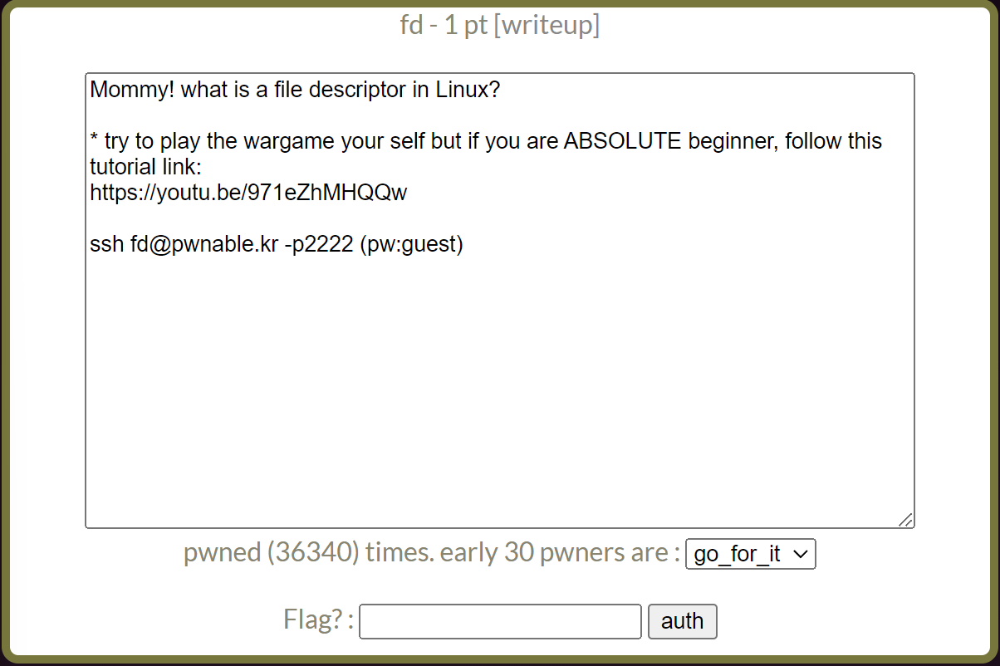

# pwnable.kr : fd
## INDEX
1. 문제 정보
    + 1.1 문제 이름
    + 1.2 문제 설명
    + 1.3 문제 분야
    + 1.4 문제 정답
2. 풀이 방법
    + 2.1 풀이 환경
    + 2.2 풀이 내용
    + 2.3 exploit code
---
## 1. 문제 정보
### 1.1 문제 이름
사이트 링크 : pwnable.kr  
문제 이름 : fd
### 1.2 문제 설명

### 1.3 문제 분야
pwnable
### 1.4 문제 정답
``` shell
fd@pwnable:~$ ./fd 4660
LETMEWIN
good job :)
mommy! I think I know what a file descriptor is!!
```
## 2. 풀이 방법
### 2.1 풀이 환경
OS : Ubuntu 18.04.6  
Architecture : x86-x64
API : pwntools  
### 2.2 풀이 내용
터미널을 실행하고, ssh fd@pwnable.kr -p2222 명령어를 입력해서 문제에 접속하도록 한다.  
터미널에 다음과 같은 화면이 나온다면, 정상적으로 접속한 것이다.
```
seopho@seopho-virtual-machine:~$ ssh fd@pwnable.kr -p2222
fd@pwnable.kr's password: 
 ____  __    __  ____    ____  ____   _        ___      __  _  ____  
|    \|  |__|  ||    \  /    ||    \ | |      /  _]    |  |/ ]|    \ 
|  o  )  |  |  ||  _  ||  o  ||  o  )| |     /  [_     |  ' / |  D  )
|   _/|  |  |  ||  |  ||     ||     || |___ |    _]    |    \ |    / 
|  |  |  `  '  ||  |  ||  _  ||  O  ||     ||   [_  __ |     \|    \ 
|  |   \      / |  |  ||  |  ||     ||     ||     ||  ||  .  ||  .  \
|__|    \_/\_/  |__|__||__|__||_____||_____||_____||__||__|\_||__|\_|
                                                                     
- Site admin : djang@sungshin.ac.kr
- IRC : irc.netgarage.org:6667 / #pwnable.kr
- Simply type "irssi" command to join IRC now
- files under /tmp can be erased anytime. make your directory under /tmp
- to use peda, issue `source /usr/share/peda/peda.py` in gdb terminal
You have mail.
Last login: Mon Dec 26 06:39:26 2022 from 118.45.36.126
```
필자는 현재 ssh 보안프로토콜을 이용해서, 원격 호스트에 접속한 상태이다.ssh 보안프로토콜에 대해서는 ctf문제를 퉁해서category에서 자세하게 글을 올려놓도록 하겠다. 어떤 문제인지를 확인하기 위해서 ls 명령어를 사용하여, 파일들을 확인해보도록 하자.
```
fd@pwnable:~$ ls -l
total 16
-r-sr-x--- 1 fd_pwn fd   7322 Jun 11  2014 fd
-rw-r--r-- 1 root   root  418 Jun 11  2014 fd.c
-r--r----- 1 fd_pwn root   50 Jun 11  2014 flag
```
fd, fd.c, flag라는 파일들이 존재한다는 것을 확인할 수 있다.  
flag파일을 읽어내는 것이 큰 목표이기 때문에 cat flag 명령어로 내용물을 확인해본다. 하지만, 기타 사용자 권한에는 읽기 권한이 없기 때문에, flag값을 읽어내는 것은 불가능했다.  
fd.c파일은 .c이기 때문에, c 소스 코드 일 것이다. 게다가 기타 사용자 권한에 읽기 권한이 있기 때문에, cat fd.c 명령어로 읽을 수 있다.  
fd파일의 이름과 fd.c파일 이름이 유사하기 때문에, fd.c 소스 코드에서 컴파일 했을 때의 결과물이 fd라는 파일일 것이다.  
이제 남은 일은 fd.c, fd 파일을 이용해서 flag값을 읽도록 하면 되는 것이다.
``` c
//fd.c
#include <stdio.h>
#include <stdlib.h>
#include <string.h>
char buf[32];
int main(int argc, char* argv[], char* envp[]){
	if(argc<2){
		printf("pass argv[1] a number\n");
		return 0;
	}
	int fd = atoi( argv[1] ) - 0x1234;
	int len = 0;
	len = read(fd, buf, 32);
	if(!strcmp("LETMEWIN\n", buf)){
		printf("good job :)\n");
		system("/bin/cat flag");
		exit(0);
	}
	printf("learn about Linux file IO\n");
	return 0;

}
```
코드를 전체적으로 훑어보니, system("/bin/cat flag"); 라는 함수가 눈에 보인다. system(const char *cmd) 함수는 명령어를 수행하는 함수이다. 즉, cat flag라는 명령어를 실행해주는 함수인 것이다.  
이 함수를 실행시키기 위해서는 if(!strcmp("LETMEWIN\n", buf))의 조건을 만족해야만 한다. strcmp함수로 전역변수인 배열 buf와 "LETMEWIN"이라는 문자열을 비교했을 때 동일하다면, 조건에 만족한다. 그러면 buf에 LETMEWIN이라는 문자열을 할당해주기만하면 된다. buf는 read(fd,buf,32)에 의해서 값이 할당된다.  
read()함수의 원형은 다음과 같다.  
ssize_t read (int fd, void *buf, size_t nbytes);  
이는 open() 함수로 열기에 성공한 파일 fd값을 확인하고, 그 fd의 내용을 nbytes만큼 읽고, buf에 할당해주는 함수이다.  
하지만, 이 소스 코드에는 open()함수가 보이지 않는다. 결국 이 문제를 해결하기 위해서 파일 디스크립터(File Descriptor)에 대해서 이해해야 한다. 파일 디스크립터에 대한 자세한 내용은 ctf문제를 퉁해서 category에서 확인하도록 하자.  
프로세스가 파일에 접근하기 위해서 파일 디스크립터라는 정수값을 이용하는데, 각 파일에 0부터 차례대로 숫자를 부여하며, 0,1,2는 프로세스가 메모리에서 실행을 시작할 때 기본적으로 할당되는 파일 디스트립터이다.   
0번은 표준입력/1번은 표준출력/2번은 표준에러를 의미한다.  
그리고 이 소스 코드의 fd를 할당받는 과정을 다음과 같다.int fd = atoi( argv[1] ) - 0x1234;문자열 argv[1]의 값을 atoi()함수를 통해서 정수형으로 변경하고, 그 값을 0x1234와 빼기를 한 뒤, 결과값을 fd값에 할당한다. 즉, fd값을 0으로 변경하게 하여 표준입력으로 LETMEWIN을 입력하면 flag값을 얻어낼 수 있을 것이다.  