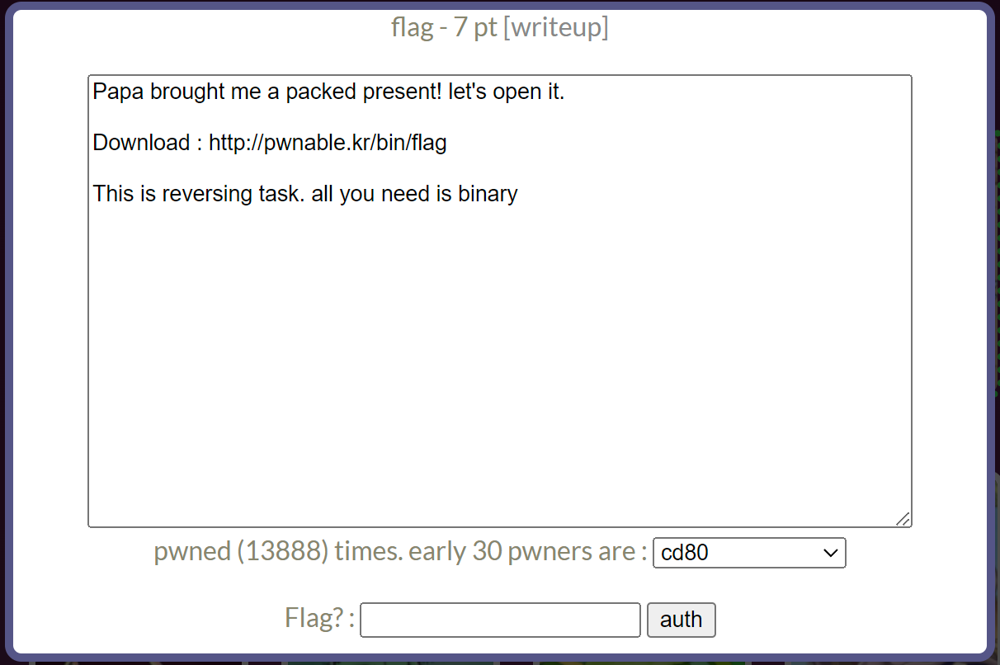

# pwnable.xyz : welcome
## INDEX
1. 문제 정보
    + 1.1 문제 이름
    + 1.2 문제 설명
    + 1.3 문제 분야
    + 1.4 문제 정답
2. 풀이 방법
    + 2.1 풀이 환경
    + 2.2 풀이 내용
    + 2.3 exploit code
---
## 1. 문제 정보
### 1.1 문제 이름
사이트 링크 : pwnable.kr  
문제 이름 : flag
### 1.2 문제 설명

### 1.3 문제 분야
pwnable
### 1.4 문제 정답
``` shell
pwndbg> x/s 0x496628
0x496628:	"UPX...? sounds like a delivery service :)"
```
## 2. 풀이 방법
### 2.1 풀이 환경
OS : Ubuntu 18.04.6 && Window 11  
Architecture : x86-x64 
### 2.2 풀이 내용
http://pwnable.kr/bin/flag 에서 flag라는 파일을 다운로드 받을 수 있다. 이것이 어떤 파일인지 확인하기 위해서 file명령어를 사용했다. 실행 파일인것을 확인할 수 있다.  
```
seopho@seopho-virtual-machine:~/Downloads/upx-4.0.1-amd64_linux$ readelf -h flagELF Header:
  Magic:   7f 45 4c 46 02 01 01 03 00 00 00 00 00 00 00 00 
  Class:                             ELF64
  Data:                              2's complement, little endian
  Version:                           1 (current)
  OS/ABI:                            UNIX - GNU
  ABI Version:                       0
  Type:                              EXEC (Executable file)
.
.
.
```
flag파일을 실행해보았지만, 실행 권한이 없기 때문에 실행할 수 없었다.  
```
seopho@seopho-virtual-machine:~/Downloads/upx-4.0.1-amd64_linux$ ./flag
bash: ./flag: Permission denied
seopho@seopho-virtual-machine:~/Downloads/upx-4.0.1-amd64_linux$ ls -l
-rw-rw-r-- 1 seopho seopho 883745  1월  6 21:14 flag
```
하지만, 읽기 권한은 있기 때문에 pwndbg로 디버깅을 하여 디스어셈블을 해보자.  
```
seopho@seopho-virtual-machine:~$ gdb flag
pwndbg> disass main
No symbol table is loaded.  Use the "file" command.
pwndbg> disass start
No symbol table is loaded.  Use the "file" command.
```
프로그래밍 언어가 c언어가 아닌지, 아니면 다른 이유인지 main함수가 디스어셈블이 되지 않았다. 어떤 프로그래밍 언어로 작성한 프로그램인지 확인하기 위해서 Exeinfo PE 라는 프로그램을 이용했다.  
.png)
맨 아래 부분을 살펴보니, 'Detected UPX! packer - http://upx.sf.net -> try unpack with *upx.exe' 라는 문장이 보인다.  
해석하면, UPX라는 것을 발견했으니깐 http://upx.sf.net 라는 사이트에서 unpacking을 하라고 한다. UPX에 대해서 구글링해보니, "UPX는 여러 운영체제에서 수많은 파일 포맷을 지원하는 오픈 소스 실행 파일 압축 프로그램"이라고 한다.   
위 링크에 접속해서 UPX를 unpacking 했다. 그리고 다시 디버깅을 해보니, 제대로 되는 것을 확인할 수 있었다.  
```
seopho@seopho-virtual-machine:~/Downloads/upx-4.0.1-amd64_linux$ gdb flag
pwndbg> disass main
Dump of assembler code for function main:
   0x0000000000401164 <+0>:	push   rbp
   0x0000000000401165 <+1>:	mov    rbp,rsp
   0x0000000000401168 <+4>:	sub    rsp,0x10
   0x000000000040116c <+8>:	mov    edi,0x496658
   0x0000000000401171 <+13>:	call   0x402080 <puts>
   0x0000000000401176 <+18>:	mov    edi,0x64
   0x000000000040117b <+23>:	call   0x4099d0 <malloc>
   0x0000000000401180 <+28>:	mov    QWORD PTR [rbp-0x8],rax
   0x0000000000401184 <+32>:	mov    rdx,QWORD PTR [rip+0x2c0ee5]        # 0x6c2070 <flag>
   0x000000000040118b <+39>:	mov    rax,QWORD PTR [rbp-0x8]
   0x000000000040118f <+43>:	mov    rsi,rdx
   0x0000000000401192 <+46>:	mov    rdi,rax
   0x0000000000401195 <+49>:	call   0x400320
   0x000000000040119a <+54>:	mov    eax,0x0
   0x000000000040119f <+59>:	leave  
   0x00000000004011a0 <+60>:	ret    
End of assembler dump.
```
확인되는 함수는 puts()함수, malloc()함수, 0x400320 함수이다. 정말 짧았기 때문에 어셈블리어를 다 확인하기로 했다.  
먼저, 0x0000000000401171 <+13>: call   0x402080 <puts> 위에   
0x000000000040116c <+8>: mov edi,0x496658  
코드가 있다. 그래서 puts()함수가 호출되기 전에 인자값으로 edi에 0x496658이라는 값을 넣는다는 것을 예측할 수 있다. puts()함수의 인자값은 보통 문자형이기 때문에, 0x496658의 값을 확인해보았다.  
```
pwndbg> x/s 0x496658
0x496658:	"I will malloc() and strcpy the flag there. take it."
```
해석하면, "나는 malloc() 함수와 strcpy 함수에 flag를 넣을 것이다. 가져가라" 이 문장을 통해서 0x400320 함수는 strcpy() 함수라고 생각할 수 있었다.  
다음으로 어셈블리상에서 malloc() 함수를 이해하기 위해서 구글링을 해보았다.
.png)
malloc() 함수는 size_t size라는 1개의 인자를 받는다. 그리고 위 영어 문장을 해석해보면, 
'당신이 원하는 바이트 수를 유일한 매개 변수로, rdi로 전달한다. "malloc를 불러라." 할당된 바이트에 대한 포인터를 rax로 반환합니다.'  
즉, 0x0000000000401176 <+18>: mov edi,0x64 이 부분을 통해서 malloc(0x64)라는 것을 확인할 수 있고, return값으로 rax에 넘기고, 0x0000000000401180 <+28>: mov QWORD PTR [rbp-0x8],rax을 통해서 rbp-0x8에 malloc()의 결과값을 넣는다는 것을 알 수 있었다.  
그 다음줄을 확인해보면,
```
   0x0000000000401184 <+32>:	mov    rdx,QWORD PTR [rip+0x2c0ee5]        # 0x6c2070 <flag>
   0x000000000040118b <+39>:	mov    rax,QWORD PTR [rbp-0x8]
   0x000000000040118f <+43>:	mov    rsi,rdx
   0x0000000000401192 <+46>:	mov    rdi,rax
   0x0000000000401195 <+49>:	call   0x400320
```
0x400320은 strcpy라는 것을 예상했었다. strcpy()는 char* dest와 const char* origin이라는 인자값을 총 2개를 받는다. 그렇기 때문에, rsi가 const char* origin이고, rdi가 char* dest라는 것을 알 수 있었다. 그리고 rdi, rax이므로  
정리하자면,'malloc(0x64)에서 생성한 메모리에 rsi,rdx를 넣는다.'라는 것을 알 수 있었다. rdx가 무엇인지만 이해하면 된다. 0x0000000000401184 <+32>: mov rdx,QWORD PTR [rip+0x2c0ee5] 코드를 통해서 rip+0x2c0ee5(0x6C2070) 메모리 주소에 있는 값을 rdx에 넣는다는 것을 알 수 있다. puts() 함수에 들어가 있는 문장을 다시 한번 생각해보자.
"나는 malloc() 함수와 strcpy 함수에 flag를 넣을 것이다. 가져가라"  
0x6c2070에 있는 값을 확인해보면 되지 않을까?  
```
pwndbg> x/gx 0x6c2070
0x6c2070 <flag>:	0x0000000000496628
```
그리고 0x0000000000496628(주소값처럼 생긴 값)을 다시 확인해보면, flag값을 확인할 수 있었다.   
```
pwndbg> x/s 0x0000000000496628
0x496628:	"UPX...? sounds like a delivery service :)"
```